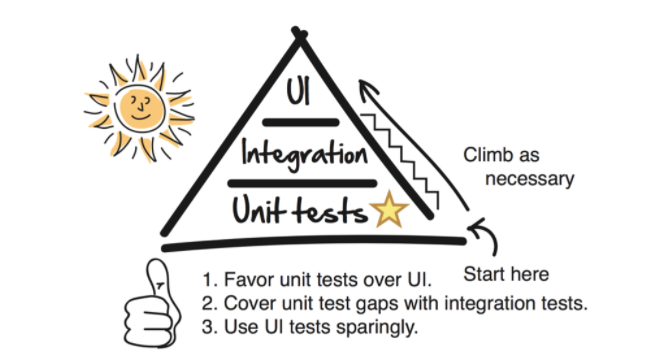

developers.redhat.com End-to-End (e2e) Testing
=============================

### Summary

This directory contains the end-to-end tests for the developers.redhat.com website. These tests are written in NodeJS using [mocha](https://mochajs.org/) test framework and [webdriver.io](http://webdriver.io/) as a driver to mimic real user interactions.

These tests are executed each time a pull request is raised on the developers.redhat.com Git repository. Branch protection rules mean that it is not possible to merge your pull request until the tests are passing, so if you are making changes to the site,
you should not neglect these tests.

The tests are split into three major sections:

* Key site functionality
* Key site functionality on a mobile device 
* Key Drupal functionality
        
## What is e2e testing?

> *“End-to-end testing is a methodology used to test whether the flow of an application is performing as designed from start to finish. The purpose of carrying out end-to-end tests is to identify system dependencies and to ensure that the right information is passed between various system components and systems.”*

## Test approach 
We try to minimise the number of e2e tests that we have, as by nature these are slow, and flaky. The developers.redhat.com website is mainly content with functionality for search, login/register, and product downloads. We focus on these core areas/user journeys only (unless there is something that cannot be covered at a unit-level. See below image:



## What do we test for key site functionality
* Search Page (DCP)
* RHEL download (Download Manager, Keycloak login)
* RHEL advanced linux cheatsheet (Download Manager, Keycloak login)
* Keycloak pages (site navigation bar navigates users to login/register pages)
* Home and Blog pages contain unique string for site monitoring.
* 404 pages

## What do we test for key Drupal functionality?
* Admin can succesfully login after changes have been applied
* All configuration changes are successfully imported after `drush cim` has been executed

## Retry strategy
As we're not mocking and using live services, test sometimes fail. In an attempt to combat this we decided to add retry logic to tests.

To rerun a certain test block just apply the number of reruns as last parameter after the test block function:
```nodejs
describe('my flaky test', function () {
    this.retries(2)
    /**
     * spec that runs max 3 times (1 actual run + 2 reruns)
     */
    it('should rerun a test at least 2 times', function () {
        // ...
    });
});
```

## Test failure(s) - what should I do?

You should investigate the failure. 

A lot of time has been spent on focusing on flaky tests, unfortunately failures do occur which could be related to one or more issues. For example it could be your changes to the UI (css selectors/new functionality), environmental issues (kc, download-manager, dcp), or our build machine has issues (out of memory). Testing downloads as a real user would is also difficult, and has proved to be flaky. Despite adding retry functionality false positives do occur. If in doubt, discuss it with the rest of the team.

Fundamentally: **pull requests should not be merged if the tests are failing** and the branch protection rules on GitHub will prevent you from doing this.

## How do I run the E2E Tests on my local machine?

### Pre-requisites

You need to ensure you have the following installed locally:

* Google Chrome
* Node `8.16.0` and npm `6.4.1`
  * The tests have not been updated to use NodeJS 10 yet.

### Running the tests

You can, and **should** test your changes locally before raising a PR. Please ensure you have Drupal running and `https://localhost` is accessible in your browser. 

Next you need to ensure that you have the following environment variables set:

* `RHD_KEYCLOAK_ADMIN_USERNAME` - The Keycloak user to log in with
* `RHD_KEYCLOAK_ADMIN_PASSWORD` - The password for the Keycloak user
* `RHD_DRUPAL_ADMIN_USERNAME` - The Drupal user to log in with to check configuration imports
* `RHD_DRUPAL_ADMIN_PASSWORD` - The password for the Drupal user

So as an example, you will need to run the following commands on your terminal before executing the tests:

```bash
export RHD_KEYCLOAK_ADMIN_USERNAME=rblake
```

Please note that currently the tests use the legacy Drupal log in mechanism and as such the Drupal user password should match what is in the database for Drupal. All Drupal passwords are sanitized in the local development environment,
so ask the rest of the development team for the sanitized password.

Once you have set the required environment variables, in the root of the project directory execute the following command:

        cd _tests/e2e && npm run e2e:local
        
This will run the full test suite using Chrome browser on your local machine.

You can alternatively run the individual components of the test suite using the following commands:

* `npm run e2e:local-drupal` - Runs only the Drupal tests
* `npm run e2e:local-desktop` - Runs only the Desktop tests
* `npm run e2e:local-mobile` - Runs only the mobile tests        

**Note:** The Download tests are currently excluded from local runs due to https://issues.jboss.org/browse/DEVELOPER-5938

        
## Run Single feature, or test
Add a unique tag to the test(s) `it.` description, for example to execute the following scenario:

```nodejs
.it('@wip @sanity : should allow users to log-in and download advanced-linux-commands', function () {
    this.retries(2)
    let siteUser = new User(process.env.RHD_BASE_URL).rhdAccountDetails();
    let cheatSheet = new CheatSheets('advanced-linux-commands');
    cheatSheet
         .open();
    cheatSheet
         .awaitLoaded();
    cheatSheet
         .loginToDownload();
    login
         .with(siteUser);
    cheatSheet
         .awaitDownload();
    downloadName = downloadDir.get();
    expect(downloadName.toString(), 'rhel advanced linux cheatsheet download was not triggered').to.include('rheladvancedlinux_cheat_sheet')
});
```
                
You can then run this single test with: **`npm run e2e:local --  --mochaOpts.grep=@wip`** 
   
 ## Override the default (local) url:
 
 The default baseUrl when running tests locally is set to `https://localhost`. To override this, you can execute:
 
              npm run e2e:local -- --base-url=https://developers.redhat.com
    
## Approach to writing tests

### Spec Classes

Example:

```nodejs
describe('Search Page', function () {
    this.retries(2);
    let siteNav, home, search;

    beforeEach(() => {
        siteNav = new NavigationBar();
        home = new Home();
        search = new Search();
    });

    it('@sanity : should allow users to search for content via site-nav search field', function () {
        home.open('/');
        siteNav.searchFor('hello world');
        expect(search.results.all().value.length).to.be.gt(0);
    });

    it("should default result sorting should be 'Relevance'", function () {
        search.open();
        let resultSort = search.resultSort.get();
        expect(resultSort).to.equal('relevance');
    });

    it("should sort results by 'Most Recent'", function () {
        home.open('/');
        siteNav.searchFor('cdk');
        search.resultSort.sort('Most Recent');
        let sR = search.results.all();
        let firstResult = search.results.dateFor(1);
        for (let i = 1; i < sR.value.length; i++) {
            let remainingResults = search.results.dateFor(i);
            expect(new Date(remainingResults).getTime()).to.be.lte(new Date(firstResult).getTime())
        }
    });

    it('should filter results by Content Type', function () {
        home.open('/');
        siteNav.searchFor('java');
        search
            .filter.choose('Content Type', 'APIs and Docs');
        search
            .results.await();
        expect(search.filter.active().getText()).to.include('APIs and Docs');
    });

    it('should filter results by Product', function () {
        home.open('/');
        siteNav.searchFor('java');
        search
            .filter.choose('Product', 'Red Hat Enterprise Linux');
        search
            .results.await();
        expect(search.filter.active().getText()).to.include('Red Hat Enterprise Linux');
    });

    it('should filter results by Topic', function () {
        home.open('/');
        siteNav.searchFor('java');
        search
            .filter.choose('Topic', 'Containers');
        search
            .results.await();
        expect(search.filter.active().getText()).to.include('Containers');
    });

    it('should clear search filters', function () {
        home.open('/');
        siteNav.searchFor('java');
        search
            .filter.choose('Topic', 'Containers');
        search
            .results.await();
        search
            .filter.clear();
        search
            .results.await();
        expect(search.filter.active().isVisible()).to.be.false
    });

    it('should not alert when user searches via site-nav search field containing malicious scripts', function () {
        home.open('/');
        siteNav.searchFor('%3Cscript%3Ealert');
        expect(search.hasAlert()).to.be.false
    });

    it('should display a product associated with a OneBox at the top of the results', function () {
        home.open('/');
        siteNav.searchFor('cdk');
        search.results.awaitResultsFor('cdk');
        expect(search.oneBox.getOneBoxTitle()).to.eq('Red Hat Container Development Kit');
    });
});

```

### Inside spec classes

When writing tests, keep it as simple and as readable as possible, where possible there should be minimal logic. Here we should only call methods from page Classes, get values from page Class methods and assert on them.

Simple Logic Examples:
- Go to page
- Perform action on page
- Assert

For example:

```nodejs
     it('@sanity: should allow users to search for content via site-nav search field', function () {
            home.open('/');
            siteNav.searchFor('hello world');
            expect(search.results.all().value.length).to.be.gt(0);
        });
```

### Page Classes

A Page Class is an object-oriented class that serves as an representation of a page of the website. 
The specs use the methods of the Page-Objects whenever they need to interact with the UI a page.

Screen classes should only do the following:
- List of element selectors (css locators)
- Actions 
- Queries

Example:

```nodejs
import {Page} from "../Page";

export class CheatSheets extends Base {

    constructor(cheatSheet) {
        super({
            path: `/cheat-sheets/${cheatSheet}/`.toString()
        });

        this.addSelectors({
            cheatSheetPage: '#rhd-cheat-sheet',
            loginToDownload: '.hidden-after-login',
            thankYou: '.thankyou'
        });
    }

    awaitLoaded() {
        return this.awaitIsVisible(this.getSelector('cheatSheetPage'));
    }

    awaitDownloadConfirmation() {
        return this.waitForUrlContaining('media-download-confirmation', 60000);
    }

    awaitDownloadThankYou() {
        this.awaitIsVisible(this.getSelector('thankYou'), 60000);
    }

    loginToDownload() {
        let downloadBtn = this.element(this.getSelector('loginToDownloadBtn'));
        let location = downloadBtn.getLocationInView();
        downloadBtn.scroll(location['x'], location['y']);
        return this.clickOn(downloadBtn);
    }
}
```

### Page Helper Methods

In Page Classes when interacting with UI elements, do so via the helper methods in the page extension "PageExtension.js".

So for example:

```nodejs
this.clickOn(selector)
```

Instead of:
```nodejs
selector.click()
```

This is because the helper methods are configured to wait for an element to exist before desired action will execute:

```nodejs
    click(selector) {
            this.awaitExists(selector);
            if (typeof selector === 'string') {
                return browser.click(selector);
            } else {
                return selector.click();
            }
        }
```
This will make your tests more robust.
       